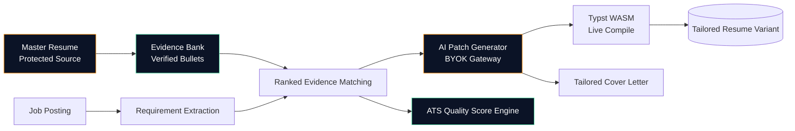

<div align="center">

# 🛠️ ResumeForge

**Local-first AI workspace that creates truthful, job-specific resume variants from one protected master resume.**

[](https://nextjs.org/)
[](https://react.dev/)
[](https://www.typescriptlang.org/)
[](https://tailwindcss.com/)
[](https://www.prisma.io/)
[](https://typst.app/)
[](https://vitest.dev/)
[]()

*Zero hallucination. Zero data leaks. Every resume bullet is a reviewable, evidence-backed patch.*

</div>

---

## 📋 Table of Contents

- [Why ResumeForge](#-why-resumeforge)
- [Key Features](#-key-features)
- [Architecture](#-architecture)
- [Tech Stack](#-tech-stack)
- [Getting Started](#-getting-started)
- [Available Scripts](#-available-scripts)
- [Project Structure](#-project-structure)
- [Philosophy](#-philosophy)

---

## 💡 Why ResumeForge

Most AI resume tools invent experience you don't have, or silently overwrite your master document. ResumeForge does neither:

| Problem with typical AI resume tools | How ResumeForge fixes it |
|---|---|
| ❌ LLM invents skills/metrics you never had | ✅ Every bullet traces back to a **verified Evidence Bank** item |
| ❌ Silent overwrites destroy your original resume | ✅ Your **Master Resume** is protected; changes are reviewable patches |
| ❌ Cloud AI providers see your resume + API keys | ✅ **Local-first, BYOK** — keys and documents never leave your machine |
| ❌ "ATS score" is just an LLM guess | ✅ **Deterministic scoring engine** with auditable, rule-based checks |

---

## ✨ Key Features

<table>
<tr>
<td width="50%" valign="top">

### 🗂️ Master Resume & Evidence Bank
Protected single source of truth storing verified work history, projects, skills, education, and metrics. Every resume bullet traces back to a verified evidence item.

### 🎯 Job Requirement Extraction
Import or paste job postings to automatically extract hard skills, soft skills, domain requirements, and role profiles into an editable requirements list.

### 🔍 Ranked Evidence Matching
Automatically ranks your Evidence Bank against a target job description — surfacing satisfied requirements, gaps, and reusable bullets.

### 🤖 AI Patch Generator (BYOK)
Generates evidence-grounded resume patches using your own OpenAI, Anthropic, or Gemini key. Keys are scrubbed client-side, never stored server-side.

</td>
<td width="50%" valign="top">

### 📊 ATS Quality Score Engine
Deterministic, rule-based scoring across base resume health, required/preferred skill match, and role-relevant evidence — plus an optional bounded AI qualitative reviewer.

### ✉️ Tailored Cover Letter Generator
Produces cover letters grounded strictly in your verified Evidence Bank, with inline citations back to source achievements.

### 📌 Job Application Tracker
Searchable, filterable pipeline for saved/applied jobs with per-job evidence-match scoring, notes, and status history.

### 📝 Typst-Powered Resume Editor
Three-pane editor (CodeMirror 6 source, live Typst WASM preview, AI Tailoring Assistant) with instant client-side compilation.

</td>
</tr>
</table>

---

## 🏗️ Architecture



All AI calls route through a **client-side BYOK gateway** — no resume content or API key ever touches a ResumeForge server.

---

## 🧱 Tech Stack

| Layer | Technology |
|---|---|
| Framework | Next.js 15 (App Router) + React 19 + TypeScript |
| Styling | Tailwind CSS + shadcn/ui — custom **"Forge Terminal"** dark design system (obsidian background, amber/emerald accents, glassmorphic panels) |
| Database | SQLite via Prisma ORM |
| Document Engine | Typst (`typst.ts` WASM browser compiler) |
| Code Editor | CodeMirror 6 |
| AI Integration | BYOK gateway — OpenAI, Anthropic, Gemini — client-side key scrubbing |
| Testing | Vitest (unit/integration) + Playwright (E2E) |

---

## 🚀 Getting Started

<details>
<summary><strong>1. Clone the repository</strong></summary>

```bash
git clone https://github.com/ZenzerJs/ResumeForge.git
cd ResumeForge
```
</details>

<details>
<summary><strong>2. Install dependencies</strong></summary>

```bash
npm install
```
</details>

<details>
<summary><strong>3. Configure environment variables</strong></summary>

```bash
cp .env.example .env
```
Fill in any required values (database URL, BYOK provider settings, etc.).
</details>

<details>
<summary><strong>4. Set up the database</strong></summary>

```bash
npx prisma migrate dev --name init
```
</details>

<details>
<summary><strong>5. Start the local development server</strong></summary>

```bash
npm run dev
```
Open [http://localhost:3000](http://localhost:3000) in your browser.
</details>

---

## 📜 Available Scripts

| Command | Description |
|---|---|
| `npm run dev` | Start the local development server |
| `npm run build` | Generate Prisma client and build for production |
| `npm run start` | Start the production server |
| `npm run lint` | Run ESLint |
| `npm run typecheck` | Run the TypeScript compiler in check-only mode |
| `npm run test` | Run the Vitest unit/integration suite |

---

## 📁 Project Structure

```
ResumeForge/
├── src/
│   ├── app/            # Next.js App Router pages (Editor, Evidence Bank, Jobs, Tailor, Settings)
│   ├── components/     # UI components — landing/, tracker/, shared design-system primitives
│   └── lib/            # AI gateway logic, theme/animation config, utilities
├── prisma/             # Database schema and migrations
├── e2e/ & tests/        # Playwright and Vitest test suites
├── DESIGN.md           # Design system reference
├── PRODUCT.md          # Product spec
└── AGENTS.md           # AI-agent working agreements for this repo
```

---

## 🎓 Philosophy

> **Truthfulness over persuasion.**

The AI never invents experience — it only rephrases, restructures, or highlights what already exists in your verified Evidence Bank. Every AI-assisted change is a **diffable, reviewable patch**, and every score or recommendation traces back to a concrete, auditable reason.

<div align="center">

*Built by [@ZenzerJs](https://github.com/ZenzerJs)*

</div>
